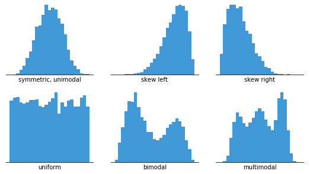

# Linear Regression on Gym Dataset

Access to Project here: [Linear Regression on Gym Dataset](https://s-m23.github.io/Portfolio/)

## Research Question – What impact does workout session duration for members of the gym have on their body fat percentage, and how can a regression model be used as supporting evidence to encourage members of the public to prioritise their activity levels?

### Executive Summary
A simple linear regression model was run on the gym_members_exercise-tracking.csv dataset (sourced from Kaggle.com) to assess how weekly workout session duration (in hours) affects the body fat percentage of members. Body fat % was the dependent variable and weekly gym duration was the independent variable. 
The results show that workout duration does have an impact on body fat %, as does water intake. Based on this linear regression analysis, increasing weekly workout duration by one hour is associated with a 1.65% decrease in body fat percentage. Therefore, it can be recommended to incorporate an additional hour of exercise into weekly routines to help reduce body fat. 
The analysis also suggests drinking more water can aid in reducing body fat, so an extra litre a day alongside increased workout duration may have an even larger impact.
The model can be rerun on real data and insights can be used to produce factual statistics around the small changes people can make to better get in shape. This will provide benefit to communities who require more of a focus on preventative care, saving healthcare organisations time and money, boosting gym membership uptake all whilst improving quality of life for individuals.

